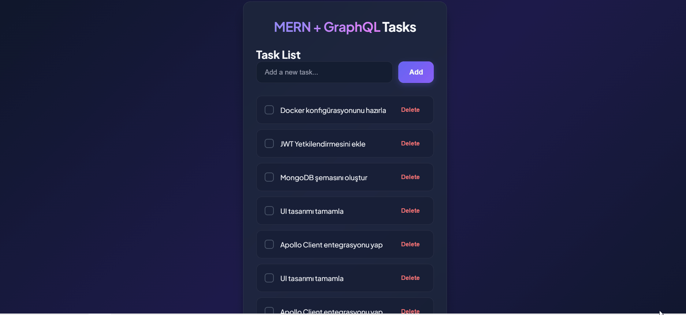

# Graph MERN Task Management App

A full-stack task management web application built with the MERN stack (MongoDB, Express, React, Node.js) and **GraphQL** architecture.



## 🚀 Technologies & Tools

### Frontend (`/client`)
- **React** & **Vite**: Fast and modern user interface
- **GraphQL Client**: Handles GraphQL queries and mutations (`queries.js`, `mutations.js`)
- **CSS3 / Oxlint**: Modern styling and code linting

### Backend (`/server`)
- **Node.js** & **Express**: Server infrastructure
- **GraphQL** (`typeDefs.js`, `resolvers.js`): Schema definitions and resolvers
- **MongoDB** & **Mongoose** (`taskModel.js`): Database modeling
- **Task Services**: Business logic service layer (`taskService.js`)

---

## 📁 Project Structure

```text
graph-mern-app/
├── client/                      # Frontend (React + Vite)
│   ├── src/
│   │   ├── components/          # React Components
│   │   │   ├── TaskForm.jsx     # Task addition/editing form
│   │   │   ├── TaskItem.jsx     # Single task card component
│   │   │   └── TaskList.jsx     # List of tasks
│   │   ├── graphql/             # GraphQL Queries & Mutations
│   │   │   ├── mutations.js
│   │   │   └── queries.js
│   │   ├── pages/               # Application pages
│   │   │   └── Tasks.jsx        # Main tasks page
│   │   ├── App.jsx
│   │   └── main.jsx
│   └── vite.config.js
│
└── server/                      # Backend (Node.js + GraphQL)
    └── src/
        ├── config/
        │   └── db.js            # MongoDB connection config
        ├── graphql/             # GraphQL Schema & Resolvers
        │   ├── typeDefs.js
        │   ├── resolvers.js
        │   └── taskService.js
        ├── models/              # Mongoose Database Models
        │   └── taskModel.js
        └── index.js              # Server entry point

```

## 📝 License
This project is licensed under the MIT License - see the LICENSE file for details.
